# «Great Sea Battle»
_Цей проєкт - найкращий спосіб показати роботу сокетів у пайтоні._
_Наша гра не тільки дозволяє отримати задоволення від ігрового процесу, а й навчитися створювати прості мережеві ігри._
_Цей проєкт був створений трьома студентами у яких не було відмазок типу "у мене немае часу", "це дуже складно" і тому подібних._
_Ми працювали в автобусі, робили зустрічі під час чищеня картоплі, пізно ввечері і навіть о 6:30 ранку._

### Склад команди:
- Микитенко Петро: [github.com/mikitenko-petro](https://github.com/mikitenko-petro)
- Єгор Галкін: [github.com/EgorGalkinORG](https://github.com/EgorGalkinORG)
- Давид Петренко: [github.com/Davidptn](https://github.com/Davidptn)

____
# Основна інформація про проєкт 
- [Ігровий процес](#алгоритм-ручного-розставлення-кораблів)
- [Як правильно запустити проєкт](#клонуємо-проєкт)
- [Бібліотеки](#бібліотеки-які-були-використані-у-проєкті)

____
# Ігровий процес:
### алгоритм ручного розставлення кораблів
1. Натискаємо на потрібний корабель, та записуємо в змінну його id
2. Натискаємо на потрібну клітинку та ставимо корабель, та перезаписуємо статус корабля та його координати
3. Щоб повернути корабель, ми натискаємо кнопку зі стрілкою біля нього та повертаємо корабель змінюючи його напрямок


### алгоритм автомотичного розтавлення кораблів
0. _для швидкого розставлення треба починати з 4х1 корабля_
1. створюємо фейковий хітбокс корабля
2. намагаємося поставити у випадковому місці, якщо не виходить поставити то намагаємося знову; якщо виходить то переходимо до слідучого корабля


### Радар
Сканує поле 3х3 клітинки та відшукує кораблі поблизу 

1. Ставимо радар на координату(не можно щоб була 1 та 10 клітинка ряда та стовбеця)
2. Відправляємо 9 запитів на перевірку поля 3х3
3. Наш хід змінюєтся на хід супротивника
4. На стороні супротивника обробляємо запити як постріли
5. Ми отримуємо дані та відмальоваємо їх на полі


### Артилерія
Рандомно стріляє в області 3х3 клітинки

1. Ставимо артілерію на координату(не можно щоб була 1 та 10 клітинка ряда та стовбеця)
2. Він випадково обирає 3 клітинки у радіусі 3х3, та відправляє їх
3. Наш хід змінюєтся на хід супротивника
4. Нам відправляются дані "попав чи не попав"


### Щит
Дозволяє защистити нашу частину корабля

1. Ставимо щит на координату на якій знаходиться наш корабель
2. Меняємо тип клітинки на щит
3. Наш хід змінюєтся на хід супротивника


4. Коли щит знищено, то клітинка щита змінюєтся на клітинку корабля
5. Відправляємо супротивнику що щит знищено
6. Хід супротивника змінюєтся на наш хід


# Важливі програмні рішення
### Storage
зберігає в собі змінні у словниках, використовуєтся для зберігання та передачі змінних без циклічного імпорту

```python
class Storage():
    def __init__(self):
        self.storage_dict = {}

    def add_variable(self, storage_object : dict):
        is_found = False
        value_key = list(storage_object.keys())

        for item in self.storage_dict.keys():
            if item != value_key[0]:
                is_found = False
            else:
                is_found = True
                break
        
        if is_found == False:
            self.storage_dict.update(storage_object)

storage = Storage()
``` 

```python

storage.add_variable({"SceneManager": SceneManager()})
``` 

```python

storage.storage_dict["SceneManager"].show(event = event)
``` 

### Search path
потрібен для створення прпавильного шляху до файла

```python
def search_path(file_name : str):
    if getattr(sys, 'frozen', False):
        path = os.path.abspath(os.path.join(".", "_internal", *file_name.split("/")))
    else:
        path = os.path.abspath(os.path.join(".", *file_name.split("/")))

    return path
```

приклад використання:

```python
image = pygame.image.load(search_path(f'static/images/{filename}')).convert_alpha()
```
____

# Бібліотеки які були використані у проєкті:
1. pygame
Для створення головної програми потрібен pygame
2. pyperclip
Для швидкого вставлення тексту потрібен pyperclip 

# Як правильно запустити проєкт

### Команди для встановлення:
ВСІ КОМАНДИ ВИКОНАТИ В git bash ТЕРМІНАЛІ

#### клонуємо проєкт
```bash
git clone https://github.com/mikitenko-petro/sea_battle_SPRINT.git
```

#### робимо віртуальне середовище
```bash
python3 -m venv venv
```
#### активуємо віртуальне середовище

##### для windows
```bash
source venv/Scripts/activate
```

##### для macOS
```bash
source venv/bin/activate
```

#### завантаження бібліотек
```bash
pip3 install -r requirements.txt
```

#### запускаємо проєкт
```bash
python main.py 
```

### або просто запустіть файл exe/pkg😅


### Введіть IP-адресу або клацніть на значок комп'ютера, якщо сервер використовує ту саму IP-адресу що й ваш, і введіть порт


____

# Основна структура проєкту:

```mermaid
%%{init: {'theme': 'dark'}}%%
graph TD
    C{sea_battle_SPRINT}-->program_modules;

    program_modules-->game_modules;

    game_modules-->abilites;
    abilites-->abilite_manager.py;
    abilite_manager.py-->artilery.py;
    artilery.py-->parent_ability_class.py;
    parent_ability_class.py-->radio_set.py;
    radio_set.py-->shield.py;

    game_modules-->achievements;
    achievements-->parent_achievement_class.py;
    parent_achievement_class.py-->achievement_manager.py;
    achievement_manager.py-->fifth_win_achievement.py;
    fifth_win_achievement.py-->first_win_achievement.py;
    first_win_achievement.py-->still_standing_achievement.py;
    still_standing_achievement.py-->three_win_achievement.py;

    game_modules-->battle;
    battle-->cell.py;
    cell.py-->check_hit_collision.py;
    check_hit_collision.py-->check_random_ship_collision.py;
    check_random_ship_collision.py-->dummy_ship.py;
    dummy_ship.py-->grid.py;
    grid.py-->ship_manager.py;
    ship_manager.py-->ship.py;

    game_modules-->capitan;
    capitan-->capitan_manager.py;

    game_modules-->quests;
    quests-->first_kill_all_smallest_ships_quest.py;
    first_kill_all_smallest_ships_quest.py-->first_kill_largest_ship_quest.py;
    first_kill_largest_ship_quest.py-->first_kill_quest.py;
    first_kill_quest.py-->in_first_move_hit_enemy_quest.py;
    in_first_move_hit_enemy_quest.py-->kill_two_ships_in_time_quest.py;
    kill_two_ships_in_time_quest.py-->parent_quest_class.py;
    parent_quest_class.py-->quest_manager.py;

    game_modules-->B{main_game_manager.py};


    program_modules-->game_widgets;
    
    game_widgets-->abillity;
    abillity-->abillity_button.py;
    abillity_button.py-->abillity_label.py;
    abillity_label.py-->buy_abillity_button.py;

    game_widgets-->decorations;
    decorations-->fire_animation_widget.py;
    fire_animation_widget.py-->radio_set_animation.py;
    radio_set_animation.py-->shield_widget.py;

    game_widgets-->ships_buttons;
    ships_buttons-->random_placement_button.py;
    random_placement_button.py-->return_button.py;
    return_button.py-->turn_button.py;

    game_widgets-->tools2[tools];
    tools2-->fps_counter.py;
    fps_counter.py-->ip_button.py;
    ip_button.py-->last_choise_button.py;

    game_widgets-->achievement_label.py;
    achievement_label.py-->capitan_icon.py
    capitan_icon.py-->emotion_label.py;
    emotion_label.py-->quest_label.py


    program_modules-->scenes;
    scenes-->achievement_screen_scene.py;
    achievement_screen_scene.py-->conect_to_server_scene.py;
    conect_to_server_scene.py-->end_screen_scene.py;
    end_screen_scene.py-->game_screen_scene.py;
    game_screen_scene.py-->main_screen_scene.py;
    main_screen_scene.py-->prepare_to_game_screen_scene.py;
    prepare_to_game_screen_scene.py-->waiting_room_screen_scene.py;

    program_modules-->tools;
    tools-->data_manager.py;
    data_manager.py-->image_container.py;
    image_container.py-->json_manager.py;
    json_manager.py-->music_manager.py;
    music_manager.py-->A;
    A{storage.py}-->scene_manager.py;
    scene_manager.py-->search_path.py;
    search_path.py-->string_manager.py;

    program_modules-->widgets;
    widgets-->pygame_animation.py;
    pygame_animation.py-->pygame_button.py;
    pygame_button.py-->pygame_check_box.py;
    pygame_check_box.py-->pygame_hitbox.py;
    pygame_hitbox.py-->pygame_image.py;
    pygame_image.py-->pygame_label.py;
    pygame_label.py-->pygame_rect.py;
    pygame_rect.py-->pygame_text_input.py;
    pygame_text_input.py-->pygame_text.py;

    program_modules-->__init__.py;
    __init__.py-->client.py;
    client.py-->pygame_setup.py;

    
    C-->static;
    static-->fonts;
    fonts-->images;
    images-->json;
    json-->sound;


    C-->venv;
    venv-->.gitignore;
    .gitignore-->requirements.txt;
    requirements.txt-->README.MD;
    README.MD-->main.py;


    style A fill:#706f70,stroke:#333,stroke-width:6px
    style B fill:#706f70,stroke:#333,stroke-width:6px
    style C fill:#4d007d,stroke:#333,stroke-width:6px
``` 

____
# Проблеми з кодом, які ми вирішили:
1. проблема структури клієнт-сервер
2. проблема маршрутизації даних
3. проблема тимчасової анімації

___
# Висновок:
### Давид
1. Пригадав материали які проходив до цього
2. Трошки навчився малювювати анімації та малюнки в Aseprite
3. По новому ознайомився з pygame
4. Навчився працювати з кординатами
5. Працював з аріфметичною прогресією

### Єгор
1. Навчився новим командам (enumerate, match/case)
2. Покращив навички у ООП
3. Покращив навички у socket
4. Повторив pygame

### Петро
1. покращив навички тімліда
2. навчився працювати з pygame (до цього майже не вчив)
3. навчився працювати з сокетами
4. вивчив принципи ООП (наслідування, інкапсуляція)
5. вивчив принципи гарної архітектури і коду проєкта (DRY, KISS)
____

# Приємної гри!