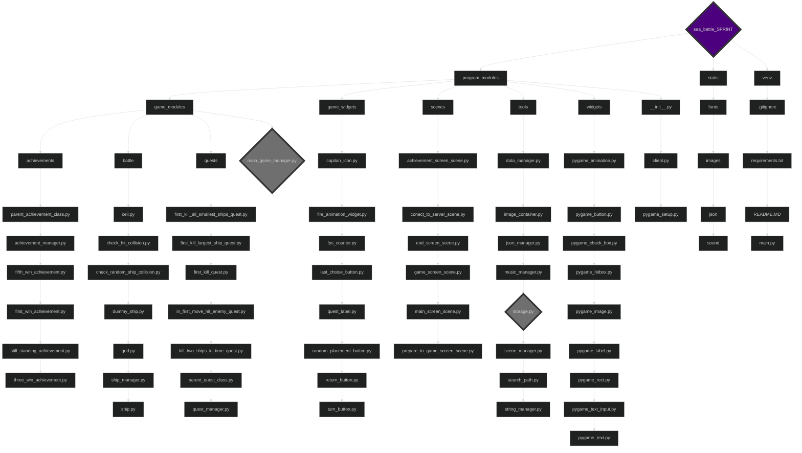

# project «Great Sea Battle» / проект «Great Sea Battle»
### Team composition / Склад команди:
- Mykytenko Petro / Микитенко Петро: [github.com/mikitenko-petro](https://github.com/mikitenko-petro)
- Hegor Halkin / Єгор Галкін: [github.com/EgorGalkinORG](https://github.com/EgorGalkinORG)
- David Petrenko / Давид Петренко: [github.com/Davidptn](https://github.com/Davidptn)

____

# How correctly run the project / Як правильно запустити проект

## Server / Сервер

### Commands for installing / Команди для встановлення:
ALL COMMANDS EXECUTE IN BASH TERMINAL / ВСІ КОМАНДИ ВИКОНАТИ В BASH ТЕРМІНАЛІ

#### clone the project / клонування проєкту
```bash
git clone https://github.com/mikitenko-petro/sea_battle_SPRINT_server.git
```

#### make virtual environment / робимо віртуальне середовище
```bash
python3 -m venv venv
```
#### activate the virtual environment / активуємо віртуальне середовище

##### for windows / для windows
```bash
source venv/Scripts/activate
```

##### for macOS / для macOS
```bash
source venv/bin/activate
```

#### run the project / запускаємо проєкт
```bash
python main.py 
```

### or just run exe/pkg file / або просто запустіть файл exe/pkg

## Game / Гра

### Commands for installing / Команди для встановлення:
ALL COMMANDS EXECUTE IN BASH TERMINAL / ВСІ КОМАНДИ ВИКОНАТИ В BASH ТЕРМІНАЛІ

#### clone the project / клонуємо проєкт
```bash
git clone https://github.com/mikitenko-petro/sea_battle_SPRINT.git
```

#### make virtual environment / робимо віртуальне середовище
```bash
python3 -m venv venv
```
#### activate the virtual environment / активуємо віртуальне середовище

##### for windows / для windows
```bash
source venv/Scripts/activate
```

##### for macOS / для macOS
```bash
source venv/bin/activate
```

#### download libraries / завантаження бібліотек
```bash
pip3 install -r requirements.txt
```

#### run the project / запускаємо проєкт
```bash
python main.py 
```

### or just run exe/pkg file😅 / або просто запустіть файл exe/pkg😅

### To play click on the button in the middle / щоб грати натисніть на кнопку по середині


### Enter the IP or click on the computer icon if server is using the same IP with your, and enter and port  / Введіть IP-адресу або клацніть на значок комп'ютера, якщо сервер використовує ту саму IP-адресу що й ваш, і введіть порт


____
# Main Information of project / Основна інформація про проект 

# Libraries which was used in the project / Бібліотеки які були використані у проекті:
1. pygame
We need pygame to create the main app / Для створення головної програми нам потрібен pygame
2. pyperclip
We need pyperclip to fast paste text / Нам потрібен pyperclip для швидкого вставлення тексту

____
# Project mechanics / Механіки проекту:

### Storage
stores variables and dictionaries / зберігає в собі змінні у словниках

```python
class Storage():
    def __init__(self):
        self.storage_dict = {}

    def add_variable(self, storage_object : dict):
        is_found = False
        value_key = list(storage_object.keys())

        for item in self.storage_dict.keys():
            if item != value_key[0]:
                is_found = False
            else:
                is_found = True
                break
        
        if is_found == False:
            self.storage_dict.update(storage_object)

storage = Storage()
``` 

Storage is needed to store and pass variables without loop import / Storage потрібен для зберігання та передачі змінних без циклічного імпорту


```python

storage.add_variable({"SceneManager": SceneManager()})
``` 

```python

storage.storage_dict["SceneManager"].show(event = event)
``` 

### Search path
need to create right path to file / потрібен для створення потрібний шлях до файла

```python
def search_path(file_name : str):
    if getattr(sys, 'frozen', False):
        path = os.path.abspath(os.path.join(".", "_internal", *file_name.split("/")))
    else:
        path = os.path.abspath(os.path.join(".", *file_name.split("/")))

    return path
```

### exemple / приклад
neded for searching images / використовуємо для пошуку зображень


```python
image = pygame.image.load(search_path(f'static/images/{filename}')).convert_alpha()
```
____
# Main Structure of project / Основна структура проекту:

____

# Code problems we solved / Проблеми з кодом, які ми вирішили:
1. client-server structure problem / проблема структури клієнт-сервер
2. data routing problem / проблема маршрутизації даних
3. temporary animation problem / проблема тимчасової анімації

___

# Conclusion / Висновок:
### Davyd / Давид
1. Studied from the best team leader / Вчився у найкращого тімліда
2. I remembered the materials I went through before. / Пригадав материали які проходив до цього
3. I learned a little about drawing animations and drawings in Aseprite / Трошки навчився малювювати анімації та малюнки в Aseprite
4. I got to know pygame in a new way / По новому ознайомився з pygame
5. Learned to work with coordinates / Навчився працювати з кординатами
6. Worked with arithmetic progression / Працював з аріфметичною прогресією

### Hegor / Єгор
1. Studied from the best team leader / Вчився у найкращого тімліда
2. Learned new commands / Навчився новим командам (enumerate, match/case)
3. Improved skills in OOP / Покращив навички у ООП
4. Improved skills in socket / Покращив навички у socket
5. Repeated pygame / Повторив pygame

### Petro / Петро
1. improved team leader skills / покращив навички тімліда
2. learned to work with pygame (I had almost no experience with it before) / навчився працювати з pygame (до цього майже не вчив)
3. learned to work with web sockets / навчився працювати з веб сокетами
4. learned OOP principles (inheritance, encapsulation) / вивчив принципи ООП (наслідування, інкапсуляція)
5. learned the principles of good project architecture and code (DRY, KISS) / вивчив принципи гарної архітектури і коду проекта (DRY, KISS)
____

# Enjoy the game! / Приємної гри!