# project «Great Sea Battle» / проект «Great Sea Battle»
### Team composition / Склад команди:
- Hegor Halkin / Єгор Галкін [github.com/EgorGalkinORG](https://github.com/EgorGalkinORG)
- Mykytenko Petro / Микитенко Петро [github.com/mikitenko-petro](https://github.com/mikitenko-petro)
- David Petrenko / Давид Петренко [github.com/Davidptn](https://github.com/Davidptn)
____

# Main Information of project / Основна інформація про проект 
### Project can / Проект може:
1. Create a Battleship game / Створювати гру у кораблі
1. Create the server / Створювати сервер
1. Connect to server / Підключатися до сервера 
____

# How correctly run the project / Як правильно запустити проект
### Libraries which you need for run the project / Бібліотеки які необхідні для запуску проекту:
1. pygame
We need pygame to create the main app / Для створення головної програми нам потрібен pygame
1. pyperclip
We need pyperclip to fast paste text / Нам потрібен pyperclip для швидкого вставлення тексту

### Command for fast installing / Команда для швидкого встановлення:
```python
pip install -r requirements.txt
```

### Run main file / Запустіть основний файл
Done! / Готово!
# How correctly run the server / Як правильно запустити сервер

### Run main file / Запустіть основний файл

### Enter your IP and any port / Введіть свій IP та будь-який порт

Done! / Готово!
____

# Main Structure of project / Основна структура проекту:

```mermaid
graph TD;
    sea_battle_SPRINT-->program_modules;
    program_modules-->game_modules;
    game_modules-->grid.py;
    game_modules-->ship.py;
    game_modules-->ships_lable.py;

    program_modules-->scenes;
    scenes-->conect_to_server_scene.py;
    scenes-->game_screen_scene.py;
    scenes-->main_screen_scene.py;
    scenes-->prepare_to_game_screen_scene.py;

    program_modules-->widgets;
    widgets-->pygame_button.py;
    widgets-->pygame_image.py;
    widgets-->pygame_label.py;
    widgets-->pygame_text_input.py;
    widgets-->pygame_text.py;

    program_modules-->__init__.py;
    program_modules-->client.py;
    program_modules-->pygame_setup.py;
    program_modules-->pygame_storage.py;
    program_modules-->scene_manager.py;
    program_modules-->search_path.py;
    
    sea_battle_SPRINT-->static;
    static-->fonts;
    static-->images;

    sea_battle_SPRINT-->.gitignore;
    sea_battle_SPRINT-->requirements.txt;

    sea_battle_SPRINT-->main.py;
``` 

____

# Conclusion / Висновок:
Project taught us how to do / Проект навчив нас як це робити:
1. Create server and clients / Створювати серверів і клієнтів
1. Taught how to make multiplayer games /  Навчив робити багатокористувацькі ігри
1. Work with pygame and others lidraries / Працювати з бібліотеками pygame та іншими
1. Work with OOP / Працювати з ООП
____
# Enjoy the game! / Приємної гри!
 